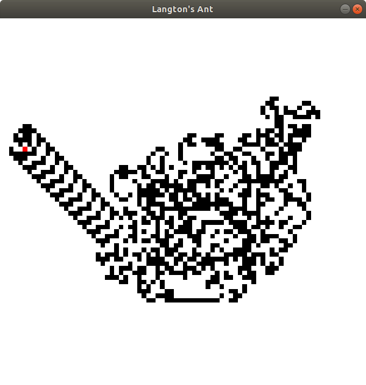

# Pixel Sketches
The sketches in this repository all use a [Golang](https://golang.org/) 2d graphics library called pixel.  
You can find more information about pixel [here](https://github.com/faiface/pixel).

## Recursive Trees

## Langton's Ant

